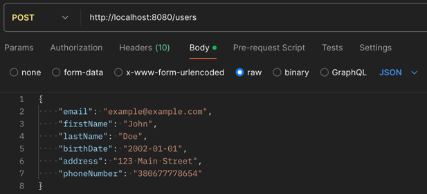
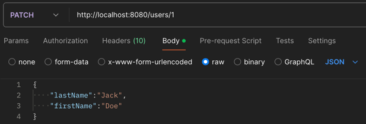
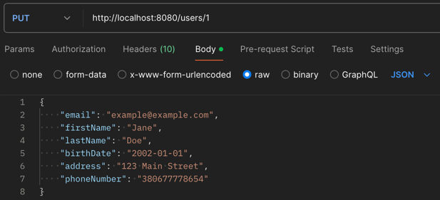
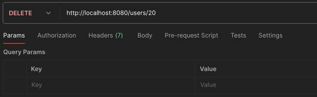
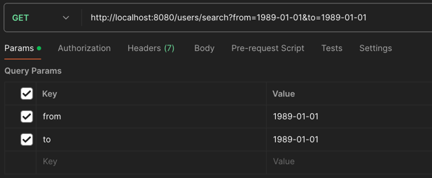

# 📖 USERS-APP 

### ⚡️ Project description
RESTful web app that allows to create user, update one/some user field, update all user fields, delete user, search 
for users by birthdate range. User data is stored in the H2 in-memory database.  The project is covered by unit and 
integration tests. Does not have UI, interaction happens through Postman.

### 🎯 Endpoints
The web app provides the following endpoints:

- <b>POST: /users</b> - add user. It allows to add users who are more than 18 years old. The value "18" can be 
changed in the application.properties file. The `address` and `phoneNumber`fields are optional. 

- <b>PATCH: /users/id</b> - update one/some user fields by id. 

- <b>PUT: /users/id</b> - update all user fields by id. 

- <b>DELETE: /users/id</b> - delete user by id. 

- <b>GET: /users/search</b> - search for users by birthdate range. Added the validation which checks that “From” 
is less than “To”. Returns a list of objects. 

### 🔥 Getting Started
To get started with the project, follow these steps:
1. Install Postman for sending requests.
2. Additional database settings are not required, it will be created automatically at the first run of the program.
3. Run the application.
4. Use this URL in Postman to test the app: http://localhost:8080/